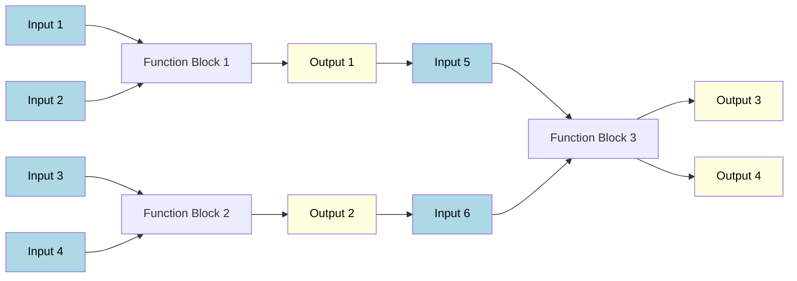

# Function Block

> Function Block supports chaining functions with multiple inputs/outputs

## Diagram

```mermaid
graph LR;
    IN1[Input 1]
    IN2[Input 2]

    IN3[Input 3]
    IN4[Input 4]

    IN5[Input 5]
    IN6[Input 6]

    OUT1[Output 1]
    OUT2[Output 2]

    OUT3[Output 3]
    OUT4[Output 4]

    FB1[Function Block 1]
    FB2[Function Block 2]
    FB3[Function Block 3]

    IN1 --> FB1
    IN2 --> FB1

    IN3 --> FB2
    IN4 --> FB2

    FB1 --> OUT1
    FB2 --> OUT2

    OUT1 --> IN5
    OUT2 --> IN6

    IN5 --> FB3
    IN6 --> FB3

    FB3 --> OUT3
    FB3 --> OUT4

    style IN1 fill:#ADD8E6,color:#000000
    style IN2 fill:#ADD8E6,color:#000000
    style IN3 fill:#ADD8E6,color:#000000
    style IN4 fill:#ADD8E6,color:#000000
    style IN5 fill:#ADD8E6,color:#000000
    style IN6 fill:#ADD8E6,color:#000000     

    style OUT1 fill:#FFFFE0,color:#000000
    style OUT2 fill:#FFFFE0,color:#000000
    style OUT3 fill:#FFFFE0,color:#000000
    style OUT4 fill:#FFFFE0,color:#000000   
```